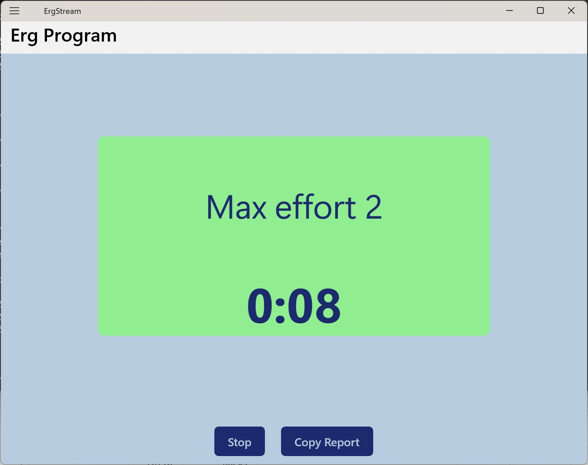
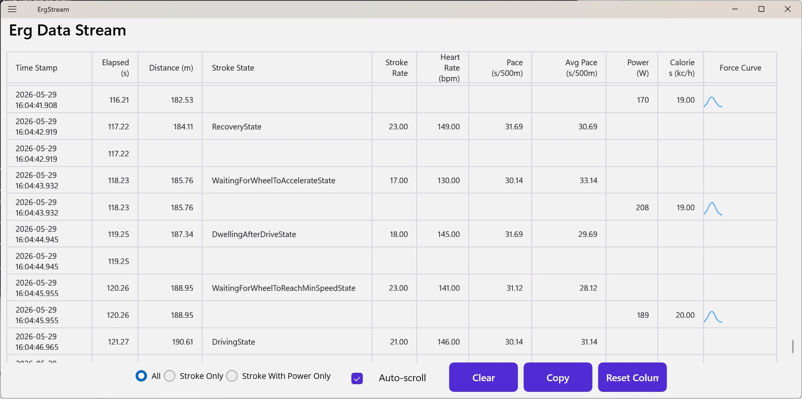

# ErgStream

A Windows desktop app for running a structured power-testing protocol on a Concept2 rowing ergometer, with a secondary mode for streaming and visualizing raw erg data in real time.

Built on .NET 10 MAUI (Windows-only) using Bluetooth Low Energy to connect to the Concept2 PM5 monitor.

## What It Does

### Research Protocol

The primary use case is administering a repeated-sprint power test to a subject on a Concept2 Row Erg. The protocol runs automatically once the erg is connected:

**6 rounds of:**
- 3 s — build to max effort (audio cue)
- 10 s — max effort sprint (power recorded)
- 27 s — active recovery

**Followed by a 2-minute cool-down.**

Audio beeps cue the subject at each transition. After the workout completes, a summary report is generated with mean power per sprint and an overall mean, ready to copy to the clipboard.

The protocol is hardcoded in [`ErgStream/ViewModels/ErgProgramViewModel.cs`](ErgStream/ViewModels/ErgProgramViewModel.cs) in the `ergProgramIntervals` array. It's straightforward to modify — each interval is a struct with a type, duration, and display label — though the code is purpose-built for this specific protocol and isn't a general-purpose interval editor.



### Raw Data Stream

A second screen streams all data packets from the erg in real time, displayed in a scrollable data grid. Columns include timestamp, elapsed time, distance, stroke state, stroke rate, heart rate, pace, average pace, power, calories, and a sparkline of the force curve for each stroke. Rows can be filtered to show all data, strokes only, or strokes with power data only. The grid contents can be copied to the clipboard for analysis.

Uses the [Syncfusion DataGrid](https://www.syncfusion.com/maui-controls/maui-datagrid) component for the live data display.



## Projects

| Project | Description |
|---|---|
| **ErgComm** | Reusable .NET library for Concept2 BLE communication and binary protocol parsing |
| **ErgStream** | MAUI Windows app — the UI and research protocol |
| **ErgCommTests** | xUnit tests for ErgComm |

### ErgComm Library

If you want a .NET interface for pulling data from a Concept2 Row Erg, the `ErgComm` project may be useful on its own. Key entry point:

```csharp
var service = new ErgCommService();

// Discover ergs (results via callback)
await service.StartFindErgsAsync(
    ergList => { /* ergList is List<ErgInfo> */ },
    cancellationToken);

// Connect and stream data
await service.ConnectToErgAsync(
    ergId,
    status => { /* ErgStatus — aggregate metrics, ~1 Hz */ },
    stroke => { /* StrokeData — per-stroke power, distance, force curve */ },
    cancellationToken);
```

`ErgStatus` delivers elapsed time, distance, pace, stroke rate, heart rate, and drag factor. `StrokeData` delivers per-stroke power (watts), distance, calories, and the full force curve. A `MockErgDriver` is included so you can develop against the interface without a physical erg.

## Building

Requires the .NET 10 SDK with the MAUI workload and a Syncfusion license key.

```powershell
# Install MAUI workload (once)
dotnet workload install maui

# Build
dotnet build ErgStream.sln

# Run (Windows only)
dotnet run --project ErgStream/ErgStream.csproj -f net10.0-windows10.0.19041.0

# Run tests
dotnet test ErgCommTests/ErgCommTests.csproj

# Publish self-contained exe
dotnet publish ErgStream/ErgStream.csproj -f net10.0-windows10.0.19041.0 -c Release -r win-x64 --self-contained true -p:PublishSingleFile=true
```

For local development without a Syncfusion license key, add an `appsettings.json` to the `ErgStream` project root:

```json
{
  "Syncfusion": {
    "LicenseKey": "your-key-here"
  }
}
```

CI builds inject the key from the `SYNCFUSION_LICENSE_KEY` repository secret and publish a self-contained `ErgStream.exe` to GitHub Releases on each push to `main`.
